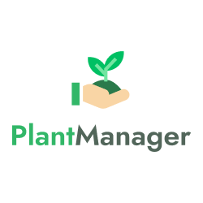
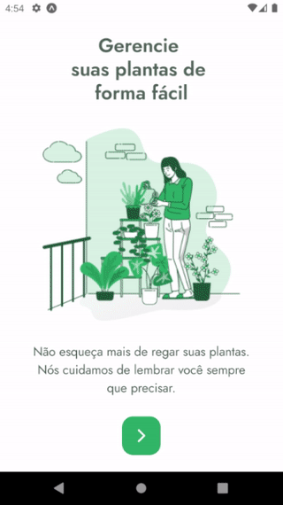

  

 

# PlantManager
Aplicativo desenvolvido durante a quinta edição do Next Level Week. O app consiste em auxiliar os usuários a gerenciar suas plantas de uma forma simples, com dicas de como cuidar de cada tipo de planta e notificações para lembrar os usuários de regar suas plantas.

# Captura de tela

  

# Principais recursos utilizados

- LocalStorage API
- Notification API
- Lottie
- React Native Gesture Handler
- React Native SVG
- Expo Google Fonts
